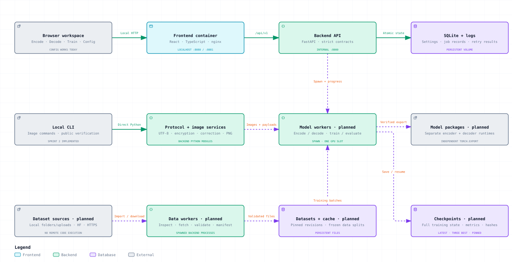

# StegoLab

A local workspace for building a text-in-image steganography system.

## Run locally with Docker

- Install and start Docker Desktop with Docker Compose.
- Run all Docker commands below from the repository root, `StegoLab/`.
- The local setup uses CPU containers. No cloud account or GPU is needed.

### Choose the local port

The default port is `8080`. If another application uses it, keep that application
running and save port `8081` for StegoLab. Create or edit `infrastructure/.env` and
add or update this line, keeping any other settings:

```dotenv
STEGOLAB_PORT=8081
```

Git ignores this local file. Compose loads it automatically with the commands
below, including in new terminals. An exported `STEGOLAB_PORT` in your shell takes
priority; run `unset STEGOLAB_PORT` if you want to use the saved file value.

### Start or apply changes

Build and start the containers, then wait for both to become healthy:

```sh
sh infrastructure/setup_local_workspace.sh
docker compose -f infrastructure/compose.yaml up --build --wait
```

The containers run in the background. Check their status:

```sh
docker compose -f infrastructure/compose.yaml ps
```

- With the saved setting above, open [StegoLab on port 8081](http://127.0.0.1:8081).
- With the default setting, open [StegoLab on port 8080](http://127.0.0.1:8080).
- Only the frontend publishes a host port, bound to `127.0.0.1`. The backend is
  reached through the frontend proxy.

### Stop

Stop StegoLab and remove its containers and network:

```sh
docker compose -f infrastructure/compose.yaml down
```

Saved settings and job data remain in the `stegolab_application_data` volume.
Do not add `--volumes` for a normal shutdown: it deletes that saved data.
Use the start command above to bring StegoLab back after stopping.

### Restart

Restart existing containers with their current configuration:

```sh
docker compose -f infrastructure/compose.yaml restart
```

To restart only the backend, add `backend_service` to that command. Use
`up --build --wait` after changing the port, Compose settings, application code,
or images; `restart` does not apply those changes.

### View logs

```sh
docker compose -f infrastructure/compose.yaml logs --tail 100 backend_service user_interface
```

See [local setup](docs/local_setup.md) for health checks, saved-setting checks,
development commands, browser tests, and troubleshooting.

## Current features and limits

- The application has four accessible tabs, a Train workspace, a working Config
  screen, strict backend contracts, persistent settings, and CPU containers. Config changes
  survive restarts; Reset restores a five-minute checkpoint interval.
- Sprint 2 provides encrypted message framing, error correction, test payload
  maps, and pixel-safe image preparation through reusable services and CLI tools.
- Sprint 3 provides local UHD-IQA preparation, grayscale support, frozen splits,
  and offline dataset integrity checks.
- Sprint 4 provides an **experimental CPU command-line engine** for training,
  saved-PNG evaluation, checkpoint inspection/resume, and separate model exports.
  See the measured [Sprint 4 acceptance record](plan/sprint_04.md).
- Sprint 5 adds pilot preparation: streamed UHD-IQA training, deterministic
  resume, explicit CPU/CUDA packages, a native-amd64 CUDA build, and guarded
  instance-time accounting. Local checks spend zero GPU hours. Start with the
  [pilot guide](docs/pilot_training.md) and [Sprint 5 evidence](plan/sprint_05.md).

- Sprint 6 makes Encode and Decode work in the browser with an explicitly
  installed **experimental** model: bounded uploads, a per-image message limit,
  decoder-verified downloads, and recovered text that lives in memory only. The
  critic, the checkpoint fork and the ledger records exist as tested code and
  have not run on a GPU. See the [GUI guide](docs/gui_training.md) and the
  measured [Sprint 6 record](plan/sprint_06.md).

The GUI connects local dataset preparation, experimental CPU training, checkpoint
review, evaluation, and exports through background jobs. Read the
[GUI training guide](docs/gui_training.md) for mounted folders, compatibility,
and the shared experiment budget. Encoding and decoding need a model installed
from Train → Model exports and stay experimental: image quality is visibly
reduced and recovery is not guaranteed. Dataset downloads remain unavailable,
and no model is approved for release. GPU readiness and model quality gates
remain open; the existing tools do not establish release-level recovery quality,
pilot readiness, or SOTA results.

## System architecture

The map covers the planned system before the training GUI integration. **Solid
lines** show its original implemented paths; **dashed lines** show its roadmap.
The current application keeps two containers and runs local training/data jobs
as supervised processes inside the backend. The [GUI guide](docs/gui_training.md)
describes this newer integration. Configuration, job metadata, events, and
artifact references are stored in SQLite.

[](Architecture.md)

Read [Architecture.md](Architecture.md) for component responsibilities, message
and image flows, contracts, storage, security, training, deployment, and roadmap.
The [Archify guide](docs/architecture.md) links the interactive local map and
explains how to reproduce both diagrams.

## Project guides

- [Full system architecture: implemented and planned](Architecture.md)
- [Local setup, checks, and troubleshooting](docs/local_setup.md)
- [Sprint 1 backlog and acceptance results](plan/sprint_01.md)
- [Sprint 2 backlog and acceptance results](plan/sprint_02.md)
- [Sprint 3 plan: local UHD-IQA preparation and manifests](plan/sprint_03.md)
- [Sprint 4: experimental CPU model engine and acceptance record](plan/sprint_04.md)
- [Sprint 5: preparation for a later GPU readiness test](plan/sprint_05.md)
- [Experimental CPU training, evaluation, checkpoints, and exports](docs/model_training.md)
- [Local datasets, grayscale support, and offline verification](docs/datasets.md)
- [Message protocol and public demonstration](docs/message_protocol.md)
- [Image inspection and PNG preparation](docs/image_preparation.md)
- [Interactive architecture map and reproduction steps](docs/architecture.md)
- [Frontend binding proof](docs/client_binding_proof.md)
- [Backend plan](plan/backend.md), [frontend plan](plan/frontend.md),
  [infrastructure plan](plan/infrastructure.md), and
  [execution order](plan/execution_order.md)
